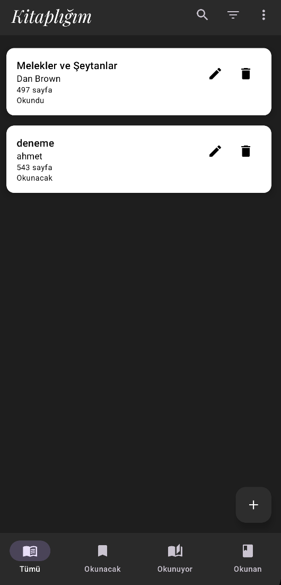
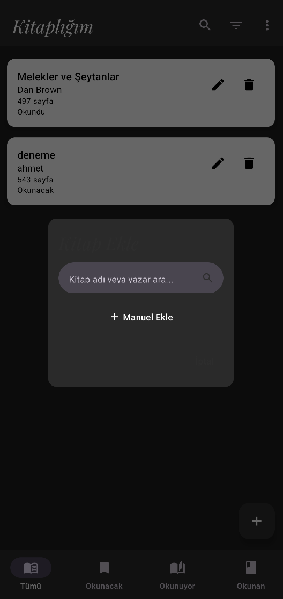
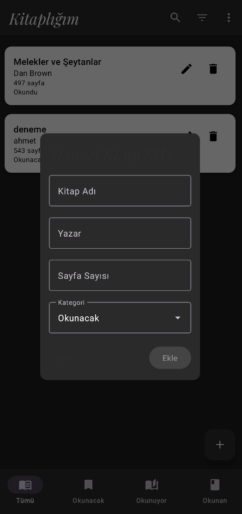

# 📚 Kitaplık - Android Kitap Takip Uygulaması

Kitaplık, okuyucuların kitaplarını kolayca yönetmelerini sağlayan modern bir Android uygulamasıdır. Material Design 3 prensipleri ve en güncel Android teknolojileri kullanılarak geliştirilmiştir.

## 🌟 Ekran Görüntüleri

<table>
  <tr>
    <td></td>
    <td></td>
    <td></td>
  </tr>
  <tr>
    <td>Kitaplık</td>
    <td>Kitap Arama</td>
    <td>Kitap Ekleme</td>
  </tr>
</table>

## 🌟 Özellikler

- **Kitap Yönetimi**
  - Kitap ekleme, düzenleme ve silme
  - Google Books API entegrasyonu ile kitap arama
  - Manuel kitap girişi
  - Okuma durumu takibi (Okunacak, Okunuyor, Okundu)

- **Okuma Hedefleri**
  - Yıllık okuma hedefi belirleme
  - Hedef ilerleme takibi
  - Tamamlanan kitap sayısı istatistikleri

- **Modern UI/UX**
  - Material Design 3 tasarım
  - Karanlık/Aydınlık tema desteği
  - Sezgisel kullanıcı arayüzü

## 🛠️ Kullanılan Teknolojiler

- **Kotlin** - Modern Android geliştirme dili
- **Jetpack Compose** - Modern UI geliştirme toolkit'i
- **Material Design 3** - Google'ın en son tasarım sistemi
- **Room Database** - Yerel veri depolama
- **Hilt** - Dependency injection
- **Coroutines & Flow** - Asenkron işlemler
- **Google Books API** - Kitap arama entegrasyonu
- **Retrofit** - API istekleri
- **MVVM** - Modern mimari yapı

## 🚀 Kurulum

1. Projeyi klonlayın
2. Android Studio'da açın
3. Gradle sync işlemini tamamlayın
4. Uygulamayı çalıştırın

## 📄 Lisans

Bu proje MIT lisansı altında lisanslanmıştır. 